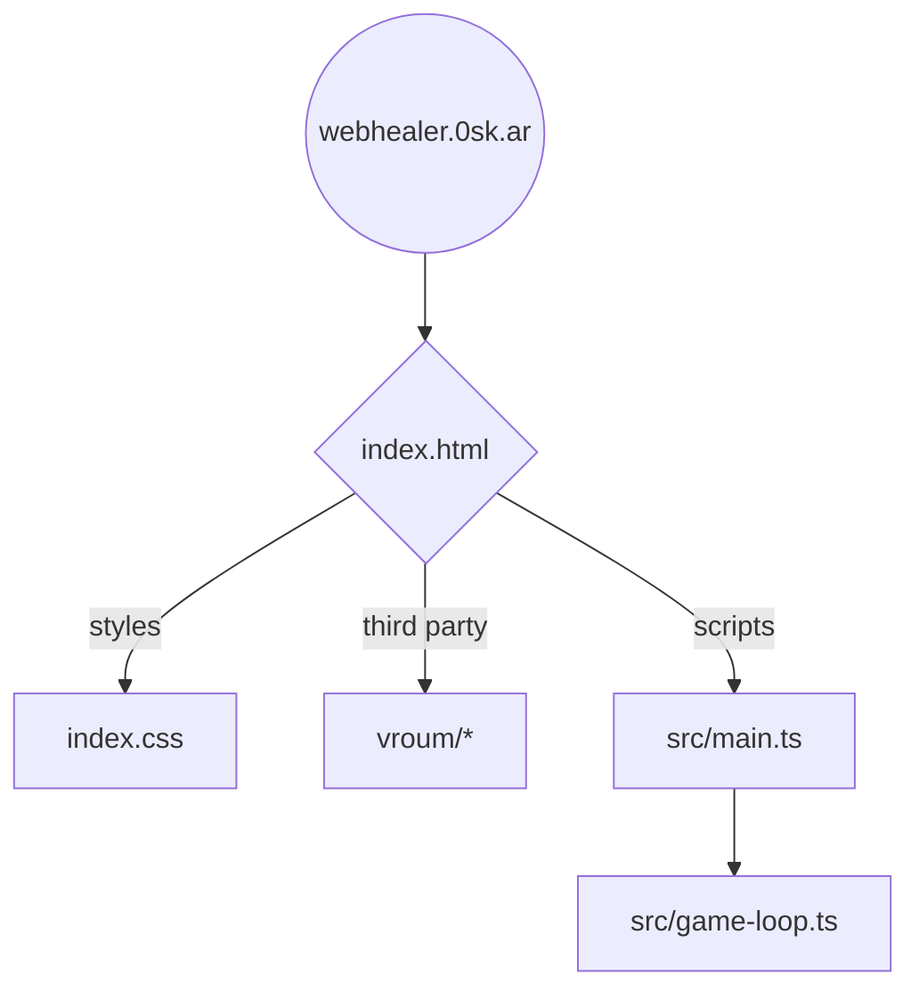
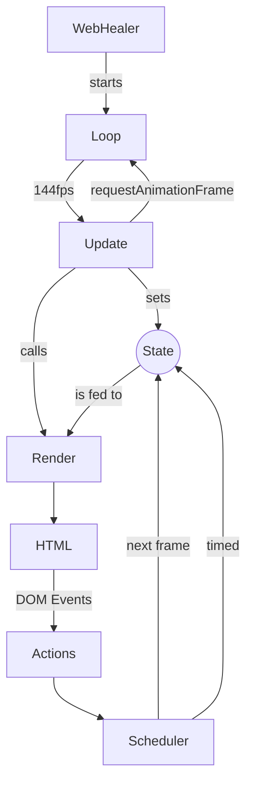

# Web Healer

A little game for the web inspired by healing raids and five man dungeons back in Azeroth. Who remembers Heal Rank 2?

- Play on https://webhealer.0sk.ar

A work in progress and happy to welcome new contributors.

## Game concept & ideas

Random notes to keep for later.

- Most spells trigger a global cooldown (GCD) of 1.5 seconds. During this time you cannot cast any other spells
- Mana regen is paused for 2 seconds whenever a cast completes
- Show combat stats once combat ends: Amount healed, Overhealing, Mana spent
- Experience? Why?
- Talents and talent points?
- Spells
	- Renew
	- Dispel
	- Heal
	- Fast Heal
	- Shield
	- Vampiric Something

## Development

This project used to have no build system, but I gave up. So now you `npm run dev` for a local development server.

### Structure

It's a static HTML website that starts with `index.html`. It loads the `src/main.ts` script, which imports and starts everything. We can import the TypeScript file, because Vite is set up. This way we can use TS + npm packages freely.

The game uses the `vroum` (https://gitlab.com/jfalxa/vroum library). Vroum helps organize everything in a tree structure of `Nodes` along with schedulable `Tasks` that run on a requestAnimationFrame loop.

To make it easier to write HTML element with JavaScript, we use https://github.com/WebReflection/uhtml.

## References

- Games as World of Warcraft, Mini Healer, Little Healer
- https://gameprogrammingpatterns.com/game-loop.html
- https://www.askmrrobot.com/wow/theory/mechanic/spell/heal?spec=PriestHoly&version=live
- http://www.musinggriffin.com/blog/2015/10/26/mechanics-damage-over-time
- https://www.reddit.com/r/wow/comments/3hrgp5/little_healer_wow_healer_simulator_nostalgia/
- https://flotib.github.io/WoW-Healer-Training/index.html
- https://questionablyepic.com/
- https://docs.google.com/spreadsheets/d/1rD3V8v3pm8BdjqOs6izsFhw79qvZ-vp3uYZYMTz62WU/edit#gid=0
- https://www.wowhead.com/classic/spells/name:renew#0-2+20
- https://mksf-birdup.itch.io/mmo-healing-simulator
- https://html.itch.zone/html/10666420/6-13-24/index.html
