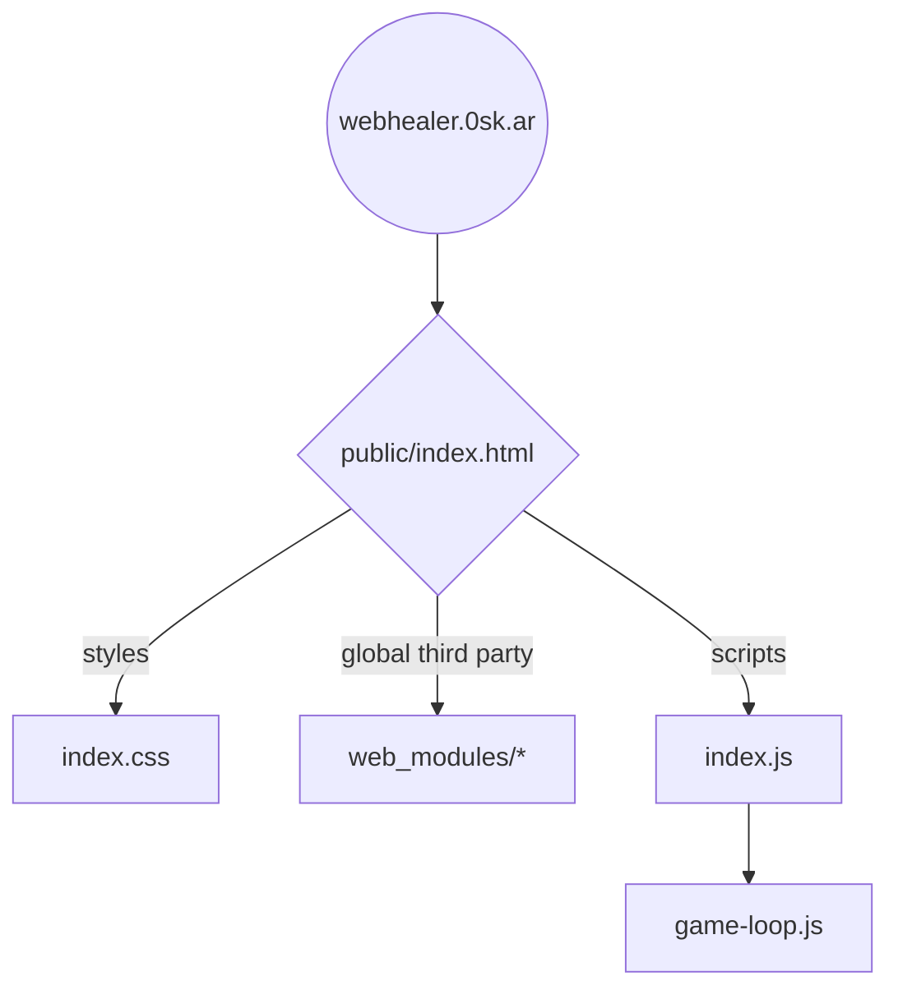

# Web Healer

A little game for the web inspired by healing raids and five man dungeons back in Azeroth. Who remembers Heal Rank 2?

- Play on https://webhealer.0sk.ar

A work in progress and happy to welcome new contributors.

## Game concept & ideas

Random notes to keep for later.

- Most spells trigger a global cooldown (GCD) of 1.5 seconds. During this time you cannot cast any other spells
- Mana regen is paused for 2 seconds whenever a cast completes
- Show combat stats once combat ends: Amount healed, Overhealing, Mana spent
- Experience? Why?
- Talents and talent points?
- Spells
	- Renew
	- Dispel
	- Heal
	- Fast Heal
	- Shield
	- Vampiric Something

## Development

No build. The `public` folder can be deployed to any static web server.

While developing locally, run

- `npm start` for a server that reloads on file change

All scripts are checked with eslint, formatted with prettier and tested with ava.

- `npm test`

### Structure

It's a static HTML website that starts with `public/index.html`. It loads the `index.js` script, which imports and starts everything.



The entire game state is stored in a single object named `state`. This is passed around everywhere.

The game loop calls update() and render() once every frame. You can customize the FPS in `state.config.fps`.

To update the game state, create an "action" function `actions.js`. Actions receive the current state as the first argument and must return an updated state.

Actions are ran immediately by default. You can also schedule them by passing a `timing` object in. Like this: `runAction(myAction, {timing: {delay: 1000, duration: 5000, repeat: 3}})`.

To render the game state, we use uhtml which renders HTML from a template string.

All third party dependencies are manually downloaded from CDNs and saved in the repo, loaded as globals or ES modules.

```graph TD
	WebHealer --> |starts| Loop --> |30fps| Update
	Update --> |requestAnimationFrame| Loop
	Update --> |sets| State((State))
	Update --> |calls| Render --> HTML --> |DOM Events| Actions

	Actions --> Scheduler
	Scheduler --> |next frame| State
	Scheduler --> |timed| State

	State --> |is fed to| Render
```

## References

- Games as World of Warcraft, Mini Healer, Little Healer
- https://gameprogrammingpatterns.com/game-loop.html
- https://www.askmrrobot.com/wow/theory/mechanic/spell/heal?spec=PriestHoly&version=live
- http://www.musinggriffin.com/blog/2015/10/26/mechanics-damage-over-time
- https://www.reddit.com/r/wow/comments/3hrgp5/little_healer_wow_healer_simulator_nostalgia/
- https://flotib.github.io/WoW-Healer-Training/index.html
