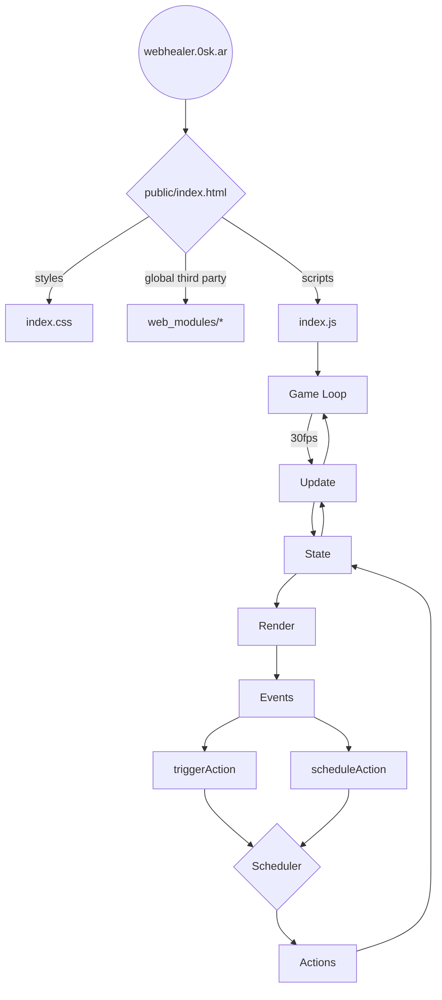

# Web Healer

A little game for the web inspired by healing raids and five man parties back in Azeroth. Who remembers Heal Rank 2?

- Play on https://webhealer.0sk.ar

A work in progress..

## Game concept & ideas

Random notes to keep for later.

- Most spells trigger a global cooldown (GCD) of 1.5 seconds. During this time you cannot cast any other spells
- Mana regen is paused for 2 seconds whenever a cast completes
- Show combat stats once combat ends: Amount healed, Overhealing, Mana spent
- Experience? Why?
- Talents and talent points?
- Spells
	- Renew
	- Dispel
	- Heal
	- Fast Heal
	- Shield
	- Vampiric Something

## Development

No build. The `public` folder can be deployed to any static web server.

While developing locally, run

- `npm start` for a server that reloads on file change

All scripts are checked with eslint, formatted with prettier and tested with ava.

- `npm test`

### Structure

It's a static HTML website that starts with `public/index.html`. It loads the `game-loop.js` script, which starts everything.

It maintains a (customizable) frame loop that runs update() and render() once every tick.

The entire game state is stored in a single object named `state`. This is passed around everywhere. To update the game state, create a function in `actions.js` that receives a state and returns a new, updated one. To keep the state immutable, we use `immer.js`.

The render loop continously renders the game state to the screen. We're not using anything fancy here, could even have been `innerHTML`, but using the uhtml library provides a few helpers that makes it nicer to use.

All dependencies are manually downloaded from CDNs and put into the repo, loaded as ES modules.

#### Graph

## References

- Games as World of Warcraft, Mini Healer, Little Healer
- https://gameprogrammingpatterns.com/game-loop.html
- https://www.askmrrobot.com/wow/theory/mechanic/spell/heal?spec=PriestHoly&version=live
- http://www.musinggriffin.com/blog/2015/10/26/mechanics-damage-over-time
- https://www.reddit.com/r/wow/comments/3hrgp5/little_healer_wow_healer_simulator_nostalgia/
- https://flotib.github.io/WoW-Healer-Training/index.html
